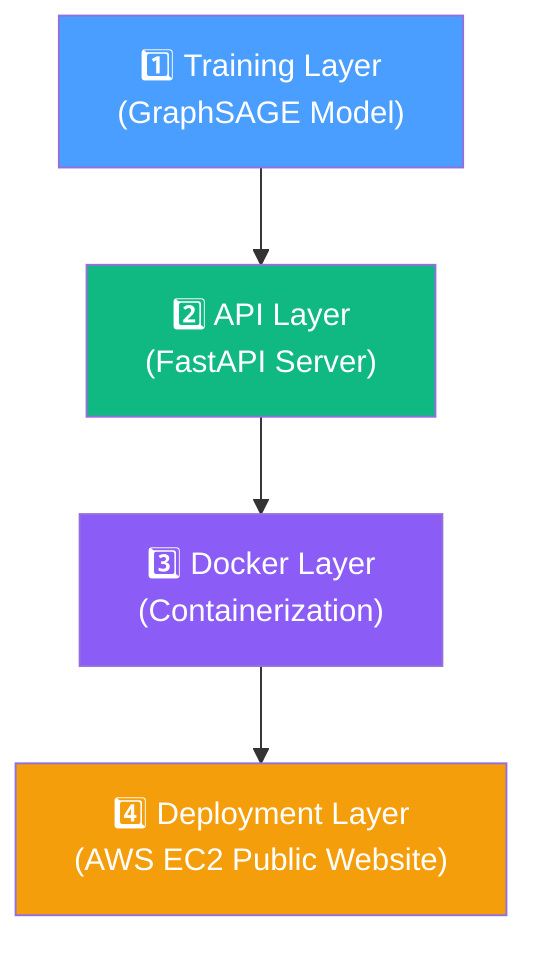

# GNN-FraudNet

<p align="center">
  
  
  
  
  
  
  
  
  
</p>

<p align="center">
  <b>AI-Powered Fraud Detection & Investigation Platform</b><br/>
  GNN (GraphSAGE/GAT) · Explainable AI (SHAP/GNNExplainer) · RAG · LLM Reports · LangGraph Agent · FastAPI · Docker · AWS
</p>

---

## 🧠 What Is This?

An end-to-end fraud detection and investigation system that combines **Graph Neural Networks** with **LLM-powered investigation reports**.

Bitcoin transactions form a **network (graph)** — money flows from one address to another. Fraudsters don't act in isolation; they create patterns of suspicious connections. A regular ML model looks at each transaction independently, but our **GraphSAGE model looks at the entire neighborhood** of a transaction to decide if it's fraud.

```
Traditional ML:   "Is THIS transaction suspicious?"   → looks at 166 features of ONE transaction
GNN (This model): "Is this suspicious GIVEN context?" → looks at the transaction AND its neighbors
This system:      "WHY is it suspicious?"              → explains, retrieves knowledge, generates report
```

The system goes beyond prediction — it provides a full **investigation pipeline** that an analyst can use to understand and act on fraud detections. 

---

## 🏗️ The 4 Layers of the Project



### 1️⃣ The Model & Data
Trained on the Elliptic dataset using PyTorch Geometric. We processed the raw graph data into `data/processed/elliptic_graph.pt` and achieved a PR-AUC of 0.92 using GraphSAGE. The model analyzes not just the 166 features of a transaction, but features aggregated from its 1-hop and 2-hop neighborhood.

### 2️⃣ The API
A FastAPI server that turns the trained PyTorch model into a usable service. Instead of requiring users to write Python scripts to load `.pt` files, any client (a website, mobile app, or bank backend) can simply send an HTTP POST request to get predictions and natural language investigation reports.

### 3️⃣ Docker Containerization
Bundles Python 3.11, PyTorch, PyG, FastAPI, the trained model, and the graph data into a single `gnn-fraudnet` image. This eliminates "works on my machine" issues and ensures that the API runs consistently on any OS without complicated setup.

### 4️⃣ AWS Deployment & Public Website
The Docker container is deployed on an AWS EC2 instance. We use Nginx as a reverse proxy to route public HTTP traffic (port 80) securely to the internal Docker container (port 8000), making the interactive cyberpunk dashboard and API endpoints accessible to the world.

---

## 🏗️ Detailed Architecture & Agentic Workflow

```
                          ┌─────────────────────┐
                          │     Transaction      │
                          │      (Node ID)       │
                          └──────────┬──────────┘
                                     │
                          ┌──────────▼──────────┐
                          │   GraphSAGE / GAT   │
                          │   Fraud Prediction   │
                          └──────────┬──────────┘
                                     │
                          ┌──────────▼──────────┐
                          │   Investigation      │
                          │   Context Builder    │
                          └────┬────────────┬───┘
                               │            │
                    ┌──────────▼──┐   ┌─────▼──────────┐
                    │SHAP / GNN   │   │RAG Retrieval    │
                    │Explainer    │   │Fraud Knowledge  │
                    └──────────┬──┘   └─────┬──────────┘
                               │            │
                          ┌────▼────────────▼───┐
                          │      LLM API        │
                          │   (Groq / Gemini)   │
                          └──────────┬──────────┘
                                     │
                          ┌──────────▼──────────┐
                          │  Natural-Language    │
                          │  Investigation       │
                          │  Report              │
                          └─────────────────────┘
```

### LangGraph Agentic Workflow
The system employs a sophisticated pipeline orchestrated by LangGraph. Each step is a LangGraph node, accumulating state as the workflow progresses:
`predict → explain → analyze_graph → retrieve_knowledge → generate_report`

1. **Predict**: Runs the GraphSAGE forward pass.
2. **Explain**: Uses GNNExplainer to identify which local and neighborhood features contributed most to the prediction.
3. **Analyze Graph**: Computes in/out degrees, 1-hop and 2-hop illicit neighborhood concentrations, and flags structural anomalies.
4. **Retrieve Knowledge**: Uses ChromaDB and sentence-transformers to query a local RAG knowledge base of fraud typologies.
5. **Generate Report**: Injects the structured context into a prompt for the Groq (or Gemini) LLM, generating a comprehensive markdown report for human analysts.

---

## 📊 Dataset

**Elliptic Bitcoin Dataset** — one of the few real-world labeled cryptocurrency fraud datasets.

| Property | Value |
|----------|-------|
| Nodes (transactions) | 203,769 |
| Edges (BTC flows) | 234,355 |
| Features per node | 166 |
| Illicit (fraud) | 4,545 |
| Licit (legit) | 42,019 |
| Unknown | 157,205 |

> 📥 Download → [Kaggle](https://www.kaggle.com/datasets/ellipticco/elliptic-data-set)
> Place the 3 CSVs in `data/raw/`

---

## 📈 Results & Performance

Test-set metrics from a 70/15/15 split of the labeled nodes:

| Model | F1 (Illicit) | PR-AUC | Accuracy | Uses Graph? |
|-------|:-----------:|:------:|:--------:|:-----------:|
| Logistic Regression | 0.602 | 0.757 | 0.880 | ✗ |
| Random Forest | 0.950 | 0.983 | 0.991 | ✗ |
| **XGBoost** | **0.954** | **0.987** | **0.991** | ✗ |
| **GraphSAGE** | **0.739** | **0.917** | **0.936** | **✓** |
| GAT | 0.449 | 0.615 | 0.779 | ✓ |

> **Honest takeaway:** Tree-based baselines (XGBoost, RF) beat GNNs on this specific dataset because the 166 engineered features already encode rich neighborhood information. However, GraphSAGE demonstrates strong graph-aware learning, clearly beating linear models, and excels at leveraging structural context dynamically.

---

## 🚀 Quick Start (Local Development)

### Prerequisites
- Python 3.11+
- [Groq API key](https://console.groq.com/keys) or [Gemini API key](https://aistudio.google.com) (free — for LLM reports)

### 1. Clone & Setup
```bash
git clone https://github.com/Piyush314159/GNN-FraudNet.git
cd GNN-FraudNet
python3 -m venv .venv
source .venv/bin/activate
pip install -r requirements.txt
pip install python-dotenv chromadb sentence-transformers google-genai langgraph groq
```

### 2. Configure
```bash
cp .env.example .env
# Edit .env and add your GROQ_API_KEY or GEMINI_API_KEY
# (Set LLM_PROVIDER=groq or gemini)
```

### 3. Run Locally
```bash
uvicorn api.main:app --reload --port 8000
```
Open **http://localhost:8000** in your browser to view the interactive dashboard.

### 4. Test the Investigation Endpoint
```bash
# Investigate a known illicit node using curl
curl -X POST http://localhost:8000/investigate/42 \
  -H "Content-Type: application/json" \
  -d '{"include_shap": false, "explanation_top_k": 10}'
```

### 5. Docker Build
```bash
docker-compose up --build
# Or manually:
docker build -t gnn-fraudnet .
docker run -p 8000:8000 --env-file .env gnn-fraudnet
```

---

## ☁️ AWS Deployment & Public Website

The final production service is hosted on AWS, exposing the interactive dashboard and API to the public internet using a secure Nginx reverse proxy architecture. We utilize Groq's fast LLM API (`openai/gpt-oss-120b`) to overcome Gemini's rate limits and generate reports in ~3.7 seconds.

### Architecture

```
Public User / Browser → HTTP (:80) → AWS Security Group → Nginx Reverse Proxy 
                                                                ↓ 
AWS EC2 Instance (m7i-flex.large) ← 127.0.0.1:8000 ← Docker Container ← FastAPI 
                                                                ↓
Investigation Report ← Groq LLM API ← ChromaDB RAG ← GraphSAGE ← GNNExplainer
```

### Deployment Steps

1. **Launch EC2 Instance**: Use an `m7i-flex.large` (2 vCPUs, 8 GiB RAM, 30GB EBS) running **Ubuntu 24.04 LTS**.
2. **Install Dependencies**:
   ```bash
   sudo apt update && sudo apt install -y docker.io docker-compose nginx
   sudo usermod -aG docker ubuntu
   ```
3. **Transfer Files to EC2**:
   ```bash
   # Make sure you transfer the large processed graph artifact
   scp -i ~/gnn-key.pem -r GNN-FraudNet/ ubuntu@<EC2_PUBLIC_IP>:~/
   ```
4. **Configure the App Environment**:
   ```bash
   cd ~/GNN-FraudNet
   cp .env.example .env
   # Edit .env to add your GROQ_API_KEY (Set LLM_PROVIDER=groq)
   ```
5. **Configure Nginx as a Reverse Proxy**:
   Create a configuration in `/etc/nginx/sites-available/gnn-fraudnet`:
   ```nginx
   server {
       listen 80;
       server_name <EC2_PUBLIC_IP>;
       location / {
           proxy_pass http://127.0.0.1:8000;
           proxy_set_header Host $host;
           proxy_set_header X-Real-IP $remote_addr;
           proxy_set_header X-Forwarded-For $proxy_add_x_forwarded_for;
       }
   }
   ```
   Enable the site, disable the default, and reload Nginx:
   ```bash
   sudo ln -s /etc/nginx/sites-available/gnn-fraudnet /etc/nginx/sites-enabled/
   sudo rm /etc/nginx/sites-enabled/default
   sudo systemctl reload nginx
   ```
6. **Run the Docker Container**:
   ```bash
   # Docker is securely bound to 127.0.0.1:8000
   docker-compose up -d
   ```
7. **AWS Security Group Configuration**: Allow inbound **HTTP on port 80** and **SSH on port 22** (restricted to your IP address). Do **NOT** expose port 8000 directly to the internet.

### Troubleshooting AWS Deployments
During deployment, several engineering challenges were addressed:
- **PyTorch Architecture**: Docker cache issues resulted in ARM64 wheels on an x86_64 EC2 instance. This was solved by downloading specific CPU-only x86_64 PyTorch wheels (`--platform linux_x86_64`) to avoid CUDA bloat.
- **Dependency Conflicts**: Upgraded `transformers` conflicted with pinned PyTorch 2.4.0. We fixed this by pinning `sentence-transformers==3.3.1` and `transformers==4.46.3`.
- **LLM Rate Limits**: Transitioned to the Groq API from Gemini because free-tier Gemini limits caused HTTP 429 Too Many Requests errors. Groq resolved the bottleneck, dropping investigation time from ~8.5s to ~3.7s.

---

## 🔌 API Endpoints

| Method | Endpoint | Description |
|--------|----------|-------------|
| `GET` | `/` | Interactive fraud detection dashboard (AWS Website Entry) |
| `GET` | `/health` | Health check with service availability status |
| `POST` | `/predict` | Predict from 166 raw features |
| `GET` | `/predict/{node_id}` | Predict for a known graph node |
| `POST` | `/investigate/{node_id}` | **Full investigation** — prediction + explanation + RAG + LLM report |
| `GET` | `/node/{node_id}` | Graph info — degree, neighbors, structural flags |

### Investigation Response Example

```json
{
  "node_id": 78642,
  "prediction": {
    "fraud_probability": 0.1628,
    "label": "licit",
    "confidence": "high",
    "probabilities": [0.8372, 0.1628]
  },
  "explanation": {
    "method": "gnn_explainer",
    "top_features": [
      {"feature_name": "feature_149", "importance": 0.8334, "direction": "increases_fraud", "rank": 1}
    ]
  },
  "graph_analysis": {
    "in_degree": 1,
    "out_degree": 1,
    "total_degree": 2,
    "neighbors_1hop": {"total": 1, "illicit": 0, "licit": 0, "unknown": 1},
    "structural_flags": ["mostly_unknown_neighbors"]
  },
  "retrieved_context": [
    {"text": "Mixing services are designed to obscure...", "source": "Fraud Typologies", "relevance_score": 0.82}
  ],
  "investigation_report": "### 1. RISK ASSESSMENT\n- **Severity Level**: LOW\n...",
  "metadata": {
    "duration_seconds": 3.739,
    "model_name": "GraphSAGE",
    "explanation_method": "gnn_explainer"
  }
}
```

---

## 📁 Project Structure

```
GNN-FraudNet/
│
├── src/
│   ├── config.py                    ← centralized configuration
│   ├── models/
│   │   ├── graphsage.py             ← GraphSAGE model
│   │   ├── gat.py                   ← GAT model
│   │   └── baseline.py              ← LogReg / RF / XGBoost
│   ├── services/
│   │   ├── prediction.py            ← model inference service
│   │   ├── explainability.py        ← SHAP / GNNExplainer wrapper
│   │   ├── graph_analysis.py        ← neighbor & structural analysis
│   │   └── investigation.py         ← investigation context builder
│   ├── rag/
│   │   ├── knowledge_base.py        ← ChromaDB vector store
│   │   ├── retriever.py             ← semantic search
│   │   └── documents/               ← fraud knowledge markdown files
│   ├── llm/
│   │   ├── prompts.py               ← anti-hallucination prompt templates
│   │   └── report_generator.py      ← Groq/Gemini API integration
│   ├── agents/
│   │   └── investigation_agent.py   ← LangGraph workflow
│   ├── data_loader.py               ← CSV → PyG Data
│   ├── graph_builder.py             ← normalization & masks
│   ├── train.py                     ← training loop
│   ├── evaluate.py                  ← metrics & comparison
│   └── explain.py                   ← GNNExplainer + SHAP
│
├── api/
│   ├── main.py                      ← FastAPI app + all endpoints
│   ├── schema.py                    ← Pydantic request/response models
│   └── static/index.html            ← interactive dashboard UI
│
├── tests/                           ← pytest test suite
├── notebooks/                       ← research pipeline (4 notebooks)
├── data/                            ← raw CSVs + processed graph
├── results/                         ← trained models + metrics
│
├── Dockerfile
├── docker-compose.yml
├── aws.json                         ← sample AWS investigation response
├── .github/workflows/ci.yml         ← GitHub Actions CI
├── .env.example                     ← environment template
└── README.md
```

---

## 🧪 Testing

```bash
# Run all tests
python -m pytest tests/ -v

# Run specific test file
python -m pytest tests/test_prediction.py -v

# Run with coverage
python -m pytest tests/ --cov=src --cov=api
```
Tests use synthetic 50-node graphs — no need for the real dataset to run unit tests.

---

## 🛠️ Tech Stack

| Layer | Tool |
|-------|------|
| GNN Framework | PyTorch Geometric |
| Deep Learning | PyTorch 2.4.0 (CPU-Optimized for Inference) |
| Baseline Models | XGBoost · Random Forest · scikit-learn |
| Explainability | SHAP · GNNExplainer |
| RAG | ChromaDB · sentence-transformers |
| LLM | Groq (openai/gpt-oss-120b) / Google Gemini |
| Agentic Workflow | LangGraph |
| API | FastAPI · Uvicorn |
| Frontend | Vanilla HTML/CSS/JS (cyberpunk dashboard) |
| Cloud / Network | Nginx Reverse Proxy · AWS Security Groups |
| Deployment | Docker · Docker Compose · AWS EC2 (Ubuntu 24.04) |
| CI/CD | GitHub Actions |
| Testing | pytest |

---

## 🔬 Running the Full ML Pipeline

The ML pipeline was built as four notebooks. Run them **in order**:

```bash
jupyter lab notebooks/
```

| # | Notebook | What It Does |
|---|----------|--------------|
| 1 | `01_eda.ipynb` | Dataset exploration and feature analysis |
| 2 | `02_graph_construction.ipynb` | Builds the PyG Data object and adjacency matrix |
| 3 | `03_baseline_models.ipynb` | Trains LogReg, Random Forest, and XGBoost baselines |
| 4 | `04_gnn_training.ipynb` | Trains GraphSAGE / GAT and generates explainability scores |

> **Tip:** All notebooks have pre-rendered outputs — open them to see results without re-executing.

---

## 🔗 Background & Physics Connection

This project bridges **particle physics and fintech**.
The GNN message-passing framework applied here originates from work on the [Belle II experiment](https://www.belle2.org/) — where Graph Neural Networks reconstruct subatomic particle decay trees from detector hits. The fundamental logic is identical: particles leave connected traces in a detector, while fraudsters leave connected monetary traces in a blockchain. The same mathematical structural reasoning applies to both financial transaction graphs and particle physics collisions.

---

<p align="center">
  Made by <a href="https://piyush314159.github.io">Piyush</a> · IIT Hyderabad
</p>
