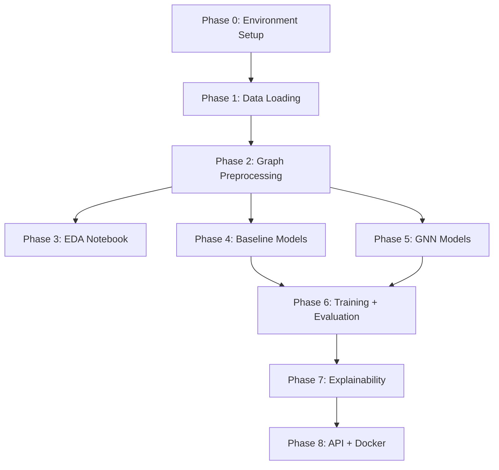

# GNN-FraudNet — Building Roadmap 🚀

> A step-by-step building path from empty scaffolding → fully working, deployed fraud detection system.

## Current State Assessment

| Component | Status |
|-----------|--------|
| Project structure | ✅ Complete |
| Raw data (Elliptic CSVs) | ✅ Downloaded (689 MB features + edges + classes) |
| `requirements.txt` | ✅ All deps listed |
| Source files (`src/`) | ⬜ All `TODO` / `pass` — specs written, no implementation |
| Notebooks (`notebooks/`) | ⬜ Empty shells (01–04) |
| API (`api/`) | ⬜ Schema done, endpoints are stubs |
| Dockerfile | ⬜ Base image only, no build steps |
| Results | ⬜ Empty `metrics.json`, no plots |

---

## Recommended Build Order



---

## Phase 0 — Environment Setup
> **Goal:** Get a working Python env with all dependencies.

| Action | Details |
|--------|---------|
| Create venv | `python -m venv .venv && source .venv/bin/activate` |
| Install PyTorch first | `pip install torch==2.4.0 torchaudio torchvision` |
| Install PyG | `pip install torch-geometric torch-scatter torch-sparse` |
| Install everything else | `pip install -r requirements.txt` |
| Verify | `python -c "import torch; import torch_geometric; print('OK')"` |

**Deliverable:** Working environment where all imports succeed.

---

## Phase 1 — Data Loading
> **Goal:** Turn the 3 raw CSVs into a single PyG `Data` object.

### Source file to implement:
#### [`data_loader.py`](file:///Users/piyushmaji/Desktop/Project/GNN-FraudNet/src/data_loader.py)

| Function | What to build |
|----------|---------------|
| `load_features(path)` | Read `elliptic_txs_features.csv`, extract txId → node mapping, return feature DataFrame (203k × 166) |
| `load_edges(path, node_mapping)` | Read `elliptic_txs_edgelist.csv`, convert txId pairs → integer indices |
| `load_labels(path, node_mapping)` | Read `elliptic_txs_classes.csv`, map `"1"→1`, `"2"→0`, `"unknown"→-1` |
| `build_pyg_data(raw_dir, save_dir)` | Orchestrate all 3, construct `Data(x, edge_index, y)`, save to `.pt` |

### Notebook to fill:
#### Part of [`01_eda.ipynb`](file:///Users/piyushmaji/Desktop/Project/GNN-FraudNet/notebooks/01_eda.ipynb) (loading cells)

### Key implementation tips:
```python
import pandas as pd
import torch
from torch_geometric.data import Data

def load_features(path):
    df = pd.read_csv(f"{path}/elliptic_txs_features.csv", header=None)
    # Column 0 = txId, columns 1-166 = features
    node_ids = df[0].values
    node_mapping = {txid: idx for idx, txid in enumerate(node_ids)}
    features = df.iloc[:, 1:].values  # (203769, 166)
    return features, node_mapping
```

**Deliverable:** `data/processed/elliptic_graph.pt` — a single PyG Data object.

**Verify:**
```python
data = torch.load('data/processed/elliptic_graph.pt')
assert data.x.shape == (203769, 166)
assert data.edge_index.shape[0] == 2
print(f"Nodes: {data.num_nodes}, Edges: {data.num_edges}")
```

---

## Phase 2 — Graph Preprocessing
> **Goal:** Normalize features, create train/val/test splits, compute class weights.

### Source file to implement:
#### [`graph_builder.py`](file:///Users/piyushmaji/Desktop/Project/GNN-FraudNet/src/graph_builder.py)

| Function | What to build |
|----------|---------------|
| `normalize_features(data)` | Z-score normalize using training node stats only (avoid leakage!) |
| `create_masks(data)` | Filter labeled nodes (y ≠ -1), split 70/15/15, set boolean mask tensors |
| `get_class_weights(data)` | Inverse-frequency weights `[w_licit, w_illicit]` for CrossEntropyLoss |
| `inspect_graph(data)` | Print summary stats: node/edge counts, class ratios |

### Notebook to fill:
#### Part of [`02_graph_construction.ipynb`](file:///Users/piyushmaji/Desktop/Project/GNN-FraudNet/notebooks/02_graph_construction.ipynb)

### Key implementation tips:
- Only ~46k nodes are labeled; ~157k are `unknown` → masks must exclude unknowns
- Class imbalance: ~4,545 illicit vs ~42,019 licit (~1:9 ratio)
- Normalize **only on training nodes**, then apply same stats to all

**Deliverable:** PyG Data object with `.train_mask`, `.val_mask`, `.test_mask` + class weight tensor.

---

## Phase 3 — EDA Notebook (Full)
> **Goal:** Understand the data deeply before modeling. This is what reviewers/interviewers look at first.

### Notebook to fill:
#### [`01_eda.ipynb`](file:///Users/piyushmaji/Desktop/Project/GNN-FraudNet/notebooks/01_eda.ipynb)

### Recommended cells (in order):

| Cell # | Content |
|--------|---------|
| 1 | **Imports & load data** — Use `data_loader.build_pyg_data()` or `torch.load()` |
| 2 | **Dataset overview** — Shape, dtypes, memory usage, first 5 rows |
| 3 | **Label distribution** — Bar chart: illicit vs licit vs unknown counts |
| 4 | **Class imbalance analysis** — Pie chart, compute imbalance ratio |
| 5 | **Feature statistics** — Describe all 166 features, check for NaN/inf |
| 6 | **Feature distributions** — Histograms for 5-10 selected features, split by class |
| 7 | **Correlation heatmap** — Top features correlated with label |
| 8 | **Graph structure** — Degree distribution, connected components, NetworkX visualization of small subgraph |
| 9 | **Temporal analysis** — Elliptic has 49 time steps; plot fraud rate per timestep |
| 10 | **Key takeaways** — Markdown summary of findings |

### Also fill:
#### [`02_graph_construction.ipynb`](file:///Users/piyushmaji/Desktop/Project/GNN-FraudNet/notebooks/02_graph_construction.ipynb)

| Cell # | Content |
|--------|---------|
| 1 | Load raw data, build PyG graph |
| 2 | Inspect graph stats using `inspect_graph()` |
| 3 | Create masks, print train/val/test sizes |
| 4 | Compute and display class weights |
| 5 | Visualize a small neighborhood (2-hop subgraph of a fraud node) |
| 6 | Save processed data |

**Deliverable:** Two fully executed notebooks with rich visualizations.

---

## Phase 4 — Baseline Models (Non-Graph)
> **Goal:** Establish performance floor. Prove that graph structure adds value.

### Source file to implement:
#### [`baseline.py`](file:///Users/piyushmaji/Desktop/Project/GNN-FraudNet/src/models/baseline.py)

| Function | What to build |
|----------|---------------|
| `train_logreg(X_train, y_train)` | `LogisticRegression(class_weight='balanced', max_iter=1000)` |
| `train_xgboost(X_train, y_train)` | `XGBClassifier(scale_pos_weight=ratio, eval_metric='aucpr')` |
| `predict_proba(model, X)` | Return `model.predict_proba(X)[:, 1]` |
| `evaluate_baseline(model, X_test, y_test, name)` | Compute F1, PR-AUC, confusion matrix |

### Notebook to fill:
#### [`03_baseline_models.ipynb`](file:///Users/piyushmaji/Desktop/Project/GNN-FraudNet/notebooks/03_baseline_models.ipynb)

| Cell # | Content |
|--------|---------|
| 1 | Load processed data, extract `X_train`, `y_train` using masks |
| 2 | Train Logistic Regression, evaluate |
| 3 | Train XGBoost, evaluate |
| 4 | Compare baselines side by side (table + PR curves) |
| 5 | Feature importance from XGBoost (top 20 bar chart) |

**Deliverable:** Baseline metrics stored; expect F1 ≈ 0.5–0.7 for XGBoost.

---

## Phase 5 — GNN Models
> **Goal:** Build the two GNN architectures.

### Source files to implement:

#### [`graphsage.py`](file:///Users/piyushmaji/Desktop/Project/GNN-FraudNet/src/models/graphsage.py)

```python
import torch
import torch.nn.functional as F
from torch_geometric.nn import SAGEConv

class GraphSAGE(torch.nn.Module):
    def __init__(self, in_channels, hidden_channels, out_channels, num_layers=2, dropout=0.5):
        super().__init__()
        self.convs = torch.nn.ModuleList()
        self.bns = torch.nn.ModuleList()
        # Layer 1: in → hidden
        self.convs.append(SAGEConv(in_channels, hidden_channels))
        self.bns.append(torch.nn.BatchNorm1d(hidden_channels))
        # Layer 2: hidden → hidden
        for _ in range(num_layers - 1):
            self.convs.append(SAGEConv(hidden_channels, hidden_channels))
            self.bns.append(torch.nn.BatchNorm1d(hidden_channels))
        self.lin = torch.nn.Linear(hidden_channels, out_channels)
        self.dropout = dropout
    
    def forward(self, x, edge_index):
        for conv, bn in zip(self.convs, self.bns):
            x = conv(x, edge_index)
            x = bn(x)
            x = F.relu(x)
            x = F.dropout(x, p=self.dropout, training=self.training)
        return self.lin(x)
```

#### [`gat.py`](file:///Users/piyushmaji/Desktop/Project/GNN-FraudNet/src/models/gat.py)

```python
import torch
import torch.nn.functional as F
from torch_geometric.nn import GATConv

class GAT(torch.nn.Module):
    def __init__(self, in_channels, hidden_channels, out_channels, heads=8, dropout=0.5):
        super().__init__()
        self.conv1 = GATConv(in_channels, hidden_channels, heads=heads, dropout=dropout)
        self.conv2 = GATConv(hidden_channels * heads, out_channels, heads=1, concat=False, dropout=dropout)
        self.dropout = dropout
    
    def forward(self, x, edge_index):
        x = F.dropout(x, p=self.dropout, training=self.training)
        x = self.conv1(x, edge_index)
        x = F.elu(x)
        x = F.dropout(x, p=self.dropout, training=self.training)
        x = self.conv2(x, edge_index)
        return x
```

**Deliverable:** Two model classes that accept `(x, edge_index)` and return logits `(N, 2)`.

---

## Phase 6 — Training + Evaluation
> **Goal:** Train both GNNs, evaluate all 4 models, produce the results table.

### Source files to implement:

#### [`train.py`](file:///Users/piyushmaji/Desktop/Project/GNN-FraudNet/src/train.py)

| Function | What to build |
|----------|---------------|
| `train_epoch()` | Forward pass → masked loss (train_mask) → backward → return loss |
| `validate()` | Eval mode → val_mask metrics → return dict |
| `train()` | Full loop: epochs, early stopping on val F1, save best checkpoint |
| `load_checkpoint()` | `model.load_state_dict(torch.load(path))` |

#### [`evaluate.py`](file:///Users/piyushmaji/Desktop/Project/GNN-FraudNet/src/evaluate.py)

| Function | What to build |
|----------|---------------|
| `compute_f1()` | `f1_score(y_true, y_pred, pos_label=1)` |
| `compute_pr_auc()` | `average_precision_score(y_true, y_prob)` |
| `compute_confusion_matrix()` | `confusion_matrix(y_true, y_pred)` |
| `plot_pr_curve()` | PR curve with matplotlib, save PNG |
| `plot_confusion_matrix()` | Seaborn heatmap, save PNG |
| `compare_models()` | Print table, dump `results/metrics.json` |

### Notebook to fill:
#### [`04_gnn_training.ipynb`](file:///Users/piyushmaji/Desktop/Project/GNN-FraudNet/notebooks/04_gnn_training.ipynb)

| Cell # | Content |
|--------|---------|
| 1 | **Setup** — Import src modules, load processed data |
| 2 | **Config** — Set hyperparameters dict |
| 3 | **Train GraphSAGE** — Initialize model, call `train()` |
| 4 | **Loss curves** — Plot training loss + val F1 over epochs |
| 5 | **Evaluate GraphSAGE** — Test set metrics, PR curve, confusion matrix |
| 6 | **Train GAT** — Same flow for GAT model |
| 7 | **Loss curves (GAT)** |
| 8 | **Evaluate GAT** |
| 9 | **Load baseline results** — From notebook 03 |
| 10 | **Final comparison table** — `compare_models()` with all 4 models |
| 11 | **Analysis** — Markdown discussion of why GNNs beat baselines |

**Deliverable:**
- `results/best_model.pt` (best GNN checkpoint)
- `results/metrics.json` (all model metrics)
- `results/plots/` (PR curves, confusion matrices)
- Filled results table in README

---

## Phase 7 — Explainability
> **Goal:** Answer "WHY was this transaction flagged?"

### Source file to implement:
#### [`explain.py`](file:///Users/piyushmaji/Desktop/Project/GNN-FraudNet/src/explain.py)

| Function | What to build |
|----------|---------------|
| `run_gnn_explainer()` | PyG's `Explainer` with `GNNExplainer` algorithm on specific nodes |
| `plot_explanation_subgraph()` | NetworkX visualization of important edges around a fraud node |
| `run_shap()` | SHAP `KernelExplainer` wrapping the GNN forward pass |
| `plot_shap_summary()` | Bar chart of top 15 features by mean |SHAP| |

### Add to notebook 04 (or create `05_explainability.ipynb`):

| Cell # | Content |
|--------|---------|
| 1 | Load best model + data |
| 2 | Pick 3 illicit nodes from test set |
| 3 | Run GNNExplainer, visualize subgraphs |
| 4 | Run SHAP on test sample (~200 nodes) |
| 5 | SHAP summary plot |
| 6 | Interpretation — which features/neighbors drive fraud predictions |

> [!TIP]
> Consider creating a separate **`05_explainability.ipynb`** notebook for this — it's substantial enough to deserve its own notebook and makes the story cleaner.

**Deliverable:** Explanation plots in `results/plots/`, understanding of model decisions.

---

## Phase 8 — API + Docker
> **Goal:** Serve the model as a REST API, containerize for deployment.

### Source file to implement:
#### [`api/main.py`](file:///Users/piyushmaji/Desktop/Project/GNN-FraudNet/api/main.py)

```python
from fastapi import FastAPI
from api.schema import TransactionRequest, FraudResponse
import torch

app = FastAPI(title="GNN-FraudNet")

@app.on_event("startup")
def startup_event():
    app.state.model = ...  # load from results/best_model.pt
    app.state.data = ...   # load from data/processed/

@app.get("/health")
def health():
    return {"status": "ok", "model": "GraphSAGE"}

@app.post("/predict", response_model=FraudResponse)
def predict(request: TransactionRequest):
    features = torch.tensor([...])  # extract 166 features
    # forward pass, softmax, return FraudResponse
```

#### [`Dockerfile`](file:///Users/piyushmaji/Desktop/Project/GNN-FraudNet/Dockerfile)

```dockerfile
FROM python:3.10-slim
WORKDIR /app
COPY requirements.txt .
RUN pip install --no-cache-dir -r requirements.txt
COPY src/ ./src/
COPY api/ ./api/
COPY results/best_model.pt ./results/best_model.pt
COPY data/processed/ ./data/processed/
EXPOSE 8000
CMD ["uvicorn", "api.main:app", "--host", "0.0.0.0", "--port", "8000"]
```

**Deliverable:** Running API at `localhost:8000`, Docker image.

---

## Summary: What to Build & In What Order

| Phase | Files to Implement | Notebook | Depends On |
|-------|-------------------|----------|------------|
| **0. Setup** | — | — | — |
| **1. Data Loading** | [`data_loader.py`](file:///Users/piyushmaji/Desktop/Project/GNN-FraudNet/src/data_loader.py) | [`01_eda.ipynb`](file:///Users/piyushmaji/Desktop/Project/GNN-FraudNet/notebooks/01_eda.ipynb) (load cells) | Phase 0 |
| **2. Graph Prep** | [`graph_builder.py`](file:///Users/piyushmaji/Desktop/Project/GNN-FraudNet/src/graph_builder.py) | [`02_graph_construction.ipynb`](file:///Users/piyushmaji/Desktop/Project/GNN-FraudNet/notebooks/02_graph_construction.ipynb) | Phase 1 |
| **3. EDA** | — | [`01_eda.ipynb`](file:///Users/piyushmaji/Desktop/Project/GNN-FraudNet/notebooks/01_eda.ipynb) (full), [`02_graph_construction.ipynb`](file:///Users/piyushmaji/Desktop/Project/GNN-FraudNet/notebooks/02_graph_construction.ipynb) | Phase 2 |
| **4. Baselines** | [`baseline.py`](file:///Users/piyushmaji/Desktop/Project/GNN-FraudNet/src/models/baseline.py) | [`03_baseline_models.ipynb`](file:///Users/piyushmaji/Desktop/Project/GNN-FraudNet/notebooks/03_baseline_models.ipynb) | Phase 2 |
| **5. GNN Models** | [`graphsage.py`](file:///Users/piyushmaji/Desktop/Project/GNN-FraudNet/src/models/graphsage.py), [`gat.py`](file:///Users/piyushmaji/Desktop/Project/GNN-FraudNet/src/models/gat.py) | — | Phase 2 |
| **6. Train + Eval** | [`train.py`](file:///Users/piyushmaji/Desktop/Project/GNN-FraudNet/src/train.py), [`evaluate.py`](file:///Users/piyushmaji/Desktop/Project/GNN-FraudNet/src/evaluate.py) | [`04_gnn_training.ipynb`](file:///Users/piyushmaji/Desktop/Project/GNN-FraudNet/notebooks/04_gnn_training.ipynb) | Phase 4 + 5 |
| **7. Explainability** | [`explain.py`](file:///Users/piyushmaji/Desktop/Project/GNN-FraudNet/src/explain.py) | `05_explainability.ipynb` (new) | Phase 6 |
| **8. API + Deploy** | [`api/main.py`](file:///Users/piyushmaji/Desktop/Project/GNN-FraudNet/api/main.py), [`Dockerfile`](file:///Users/piyushmaji/Desktop/Project/GNN-FraudNet/Dockerfile) | — | Phase 6 |

---

## Estimated Time Per Phase

| Phase | Estimated Time | Difficulty |
|-------|---------------|------------|
| Phase 0: Setup | 15 min | ⬜ Easy |
| Phase 1: Data Loading | 30–45 min | ⬜ Easy |
| Phase 2: Graph Prep | 30–45 min | 🟨 Medium |
| Phase 3: EDA Notebook | 1–2 hours | 🟨 Medium |
| Phase 4: Baselines | 30–45 min | ⬜ Easy |
| Phase 5: GNN Models | 45 min–1 hour | 🟧 Medium-Hard |
| Phase 6: Train + Eval | 1–2 hours | 🟧 Medium-Hard |
| Phase 7: Explainability | 1–2 hours | 🟧 Medium-Hard |
| Phase 8: API + Docker | 30–45 min | ⬜ Easy |
| **Total** | **~7–10 hours** | |

> [!IMPORTANT]
> **Recommendation:** Start with Phase 1 → implement `data_loader.py` → test it in `01_eda.ipynb`. Each phase builds directly on the previous one, so don't skip ahead. Would you like me to start implementing any specific phase?
