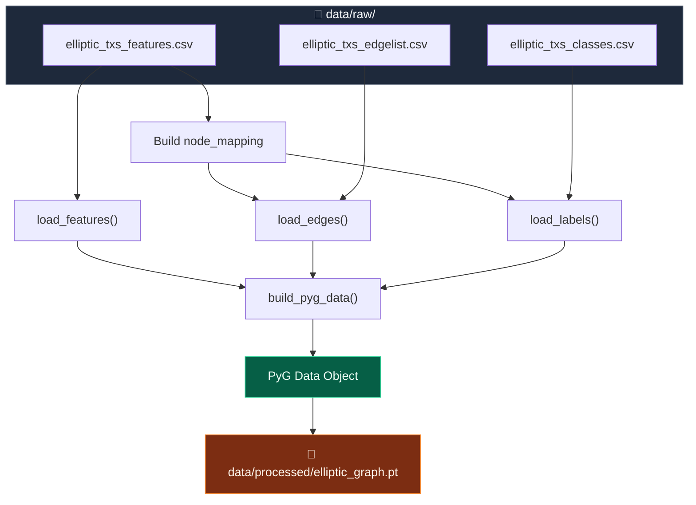
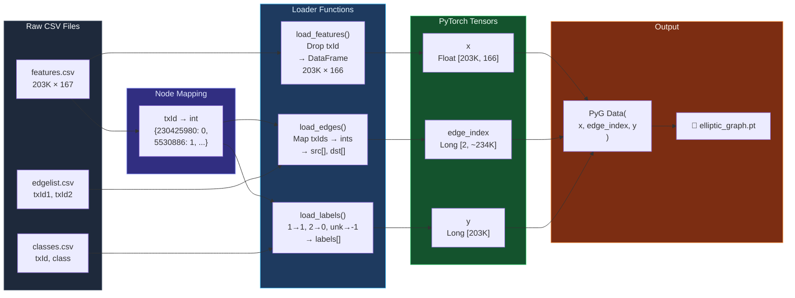
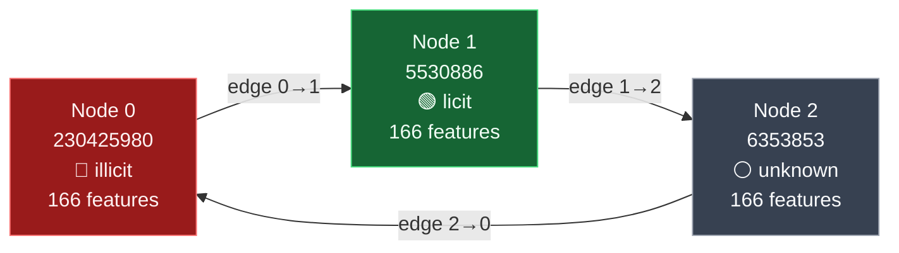

# 🔍 Data Loader — Visual Walkthrough

How [`data_loader.py`](file:///Users/piyushmaji/Desktop/Project/GNN-FraudNet/src/data_loader.py) transforms **3 raw CSV files** into a single **PyG graph** ready for GNN training.

---

## High-Level Pipeline



---

## 📄 Input File #1 — `elliptic_txs_features.csv`

> **~203,769 rows × 167 columns** (txId + 166 numeric features)

| txId | feat_1 | feat_2 | feat_3 | … | feat_166 |
|------|--------|--------|--------|---|----------|
| `230425980` | 0.002 | 1.423 | -0.33 | … | 0.87 |
| `5530886` | 0.015 | 0.091 | 0.74 | … | -1.22 |
| `6353853` | -0.007 | 2.105 | 0.12 | … | 0.03 |
| … | … | … | … | … | … |

---

## 📄 Input File #2 — `elliptic_txs_edgelist.csv`

> **Directed edges** — each row is a Bitcoin transaction flow: money went **from txId1 → to txId2**

| txId1 | txId2 |
|-------|-------|
| `230425980` | `5530886` |
| `5530886` | `6353853` |
| `6353853` | `230425980` |
| … | … |

---

## 📄 Input File #3 — `elliptic_txs_classes.csv`

> **Labels** for each transaction node

| txId | class |
|------|-------|
| `230425980` | `1` *(illicit)* |
| `5530886` | `2` *(licit)* |
| `6353853` | `unknown` |
| … | … |

---

## Step 0 — Build `node_mapping` (inside [`build_pyg_data()`](file:///Users/piyushmaji/Desktop/Project/GNN-FraudNet/src/data_loader.py#L89-L118))

Before calling any of the three loader functions, `build_pyg_data` reads the features CSV **once** to create a `dict` that maps every `txId` to a **contiguous integer index**. This mapping is shared by `load_edges()` and `load_labels()`.

```python
raw_features = pd.read_csv(features_path)
node_mapping = {tx_id: i for i, tx_id in enumerate(raw_features["txId"])}
```

**Result:**

```
node_mapping = {
    230425980 → 0,
    5530886   → 1,
    6353853   → 2,
    ...
}
```

> [!IMPORTANT]
> This mapping is the **glue** that ties all three files together. Edges and labels both reference `txId`, but the graph needs integer indices `0 … N-1`.

---

## Step 1 — [`load_features(path)`](file:///Users/piyushmaji/Desktop/Project/GNN-FraudNet/src/data_loader.py#L49-L53)

```python
def load_features(path):
    df = pd.read_csv(path)
    df = df.drop(columns=["txId"])   # ← drop ID column
    return df.astype(float)          # ← ensure all float
```

### What happens to the data:

```
  INPUT CSV (167 cols)                     OUTPUT DataFrame (166 cols)
┌──────────┬────────┬────────┬───┐       ┌────────┬────────┬───┐
│  txId    │ feat_1 │ feat_2 │...│       │ feat_1 │ feat_2 │...│
├──────────┼────────┼────────┤   │  ──▶  ├────────┼────────┤   │
│230425980 │  0.002 │  1.423 │   │       │  0.002 │  1.423 │   │  row 0
│  5530886 │  0.015 │  0.091 │   │       │  0.015 │  0.091 │   │  row 1
│  6353853 │ -0.007 │  2.105 │   │       │ -0.007 │  2.105 │   │  row 2
└──────────┴────────┴────────┴───┘       └────────┴────────┴───┘
         ▲                                        ▲
         │ txId dropped                           │ 166 float features
```

> **Returns**: `DataFrame` of shape **(203769, 166)**

---

## Step 2 — [`load_edges(path, node_mapping)`](file:///Users/piyushmaji/Desktop/Project/GNN-FraudNet/src/data_loader.py#L55-L71)

```python
def load_edges(path, node_mapping):
    df = pd.read_csv(path)
    df["txId1"] = df["txId1"].map(node_mapping)  # txId → int index
    df["txId2"] = df["txId2"].map(node_mapping)  # txId → int index
    df = df.dropna(...)                           # drop unmapped edges
    return src_array, dst_array
```

### What happens to the data:

```
  RAW EDGELIST                  AFTER .map(node_mapping)
┌────────────┬───────────┐     ┌───────┬───────┐
│   txId1    │   txId2   │     │ txId1 │ txId2 │
├────────────┼───────────┤     ├───────┼───────┤
│ 230425980  │  5530886  │ ──▶ │   0   │   1   │
│  5530886   │  6353853  │ ──▶ │   1   │   2   │
│  6353853   │ 230425980 │ ──▶ │   2   │   0   │
└────────────┴───────────┘     └───────┴───────┘
                                   │       │
                                   ▼       ▼
                              src_array  dst_array
                              [0, 1, 2]  [1, 2, 0]
```

> [!NOTE]
> If a txId in the edgelist doesn't exist in `node_mapping`, it becomes `NaN` and the edge is **dropped** (with a warning printed).

> **Returns**: `(src_array, dst_array)` — two `int64` numpy arrays

---

## Step 3 — [`load_labels(path, node_mapping)`](file:///Users/piyushmaji/Desktop/Project/GNN-FraudNet/src/data_loader.py#L73-L87)

```python
def load_labels(path, node_mapping):
    df = pd.read_csv(path)
    label_map = {"1": 1, "2": 0, "unknown": -1}
    df["class"] = df["class"].astype(str).map(label_map)
    
    labels = np.full(num_nodes, -1, dtype=np.int64)  # default = unknown
    for tx_id, cls in zip(df["txId"], df["class"]):
        idx = node_mapping.get(tx_id)
        if idx is not None:
            labels[idx] = cls
    return labels
```

### What happens to the data:

```
  RAW CLASSES CSV            LABEL MAPPING              FINAL ARRAY (indexed by node_mapping)
┌────────────┬─────────┐                              ┌───────┬───────┐
│   txId     │  class  │    "1"     → 1 (illicit)     │ index │ label │
├────────────┼─────────┤    "2"     → 0 (licit)       ├───────┼───────┤
│ 230425980  │    1    │──▶ "unknown"→-1 (unknown) ──▶│   0   │   1   │ ← illicit 🔴
│  5530886   │    2    │                               │   1   │   0   │ ← licit   🟢
│  6353853   │ unknown │                               │   2   │  -1   │ ← unknown ⚪
└────────────┴─────────┘                               └───────┴───────┘
```

> [!TIP]
> The labels array is pre-filled with `-1` (unknown). Only nodes that appear in the classes CSV **and** exist in `node_mapping` get their label updated. This ensures the array is always aligned with the feature matrix rows.

> **Returns**: `int64` numpy array of shape **(203769,)**

---

## Step 4 — [`build_pyg_data(raw_dir, save_dir)`](file:///Users/piyushmaji/Desktop/Project/GNN-FraudNet/src/data_loader.py#L89-L118) — Assembly

This is the **orchestrator** that calls all three functions and assembles the final graph.

```python
# Convert to PyTorch tensors
x          = torch.tensor(x_df.values, dtype=torch.float)     # (203769, 166)
edge_index = torch.tensor(np.stack([src, dst]), dtype=torch.long)  # (2, num_edges)
y          = torch.tensor(y_array, dtype=torch.long)           # (203769,)

# Build the PyG graph
data = Data(x=x, edge_index=edge_index, y=y)

# Save to disk
torch.save(data, "data/processed/elliptic_graph.pt")
return data
```

### Final PyG Data Object:

```
Data(
  x          = [203769, 166]   ← float tensor  (node features)
  edge_index = [2, ~234K]     ← long tensor   (graph connectivity)
  y          = [203769]        ← long tensor   (labels: 1/0/-1)
)
```

---

## 🧠 Full Data Flow — Putting It All Together



---

## 🔗 How the Graph Looks Conceptually

Using our 3-node example:



> Each **node** = a Bitcoin transaction with 166 numeric features  
> Each **edge** = a money flow between transactions  
> Each **label** = whether the transaction is fraudulent (1), legitimate (0), or unknown (-1)

---

## 📊 Dataset Statistics (Elliptic)

| Metric | Value |
|--------|-------|
| Total nodes (transactions) | **203,769** |
| Total edges (flows) | **~234,355** |
| Features per node | **166** |
| Illicit nodes (label=1) | **~4,545** (2.2%) |
| Licit nodes (label=0) | **~42,019** (20.6%) |
| Unknown nodes (label=-1) | **~157,205** (77.2%) |

> [!WARNING]
> The dataset is **highly imbalanced** — only ~2% of labeled nodes are illicit. The GNN model will need strategies like class weighting, oversampling, or focal loss to handle this.
