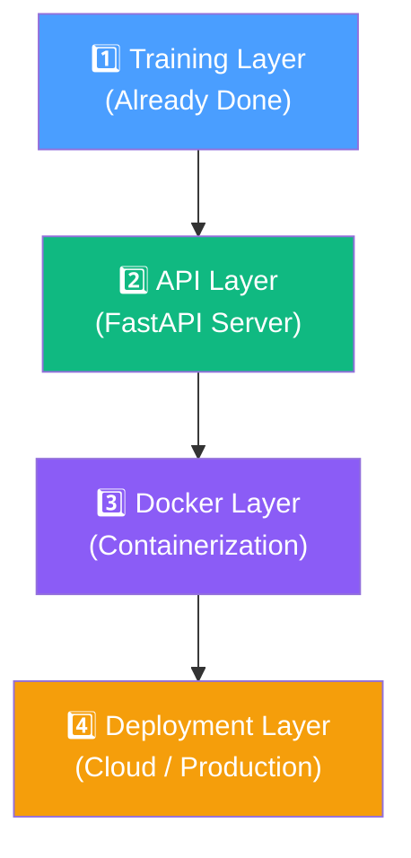
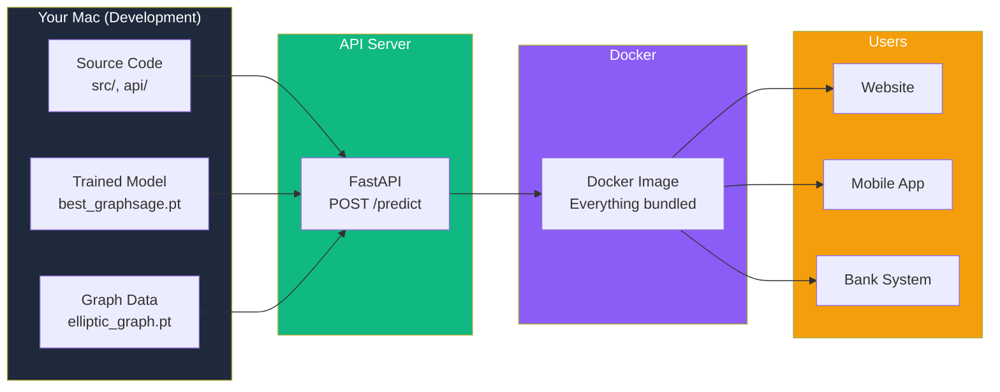

# GNN-FraudNet: The Big Picture

## What Does This Project Do?

It detects **fraudulent Bitcoin transactions** using a Graph Neural Network (GNN).

Bitcoin transactions form a **network (graph)** — money flows from one address to another. Fraudsters don't act in isolation; they create patterns of suspicious connections. A regular ML model looks at each transaction independently, but your **GraphSAGE model looks at the entire neighborhood** of a transaction to decide if it's fraud.

```
Traditional ML:  "Is THIS transaction suspicious?"  → looks at 166 features of ONE transaction
GNN (Your model): "Is this transaction suspicious GIVEN its neighbors?" → looks at the transaction AND all connected transactions
```

This is why your GNN achieves **PR-AUC 0.92** — it catches fraud patterns that traditional models miss.

---

## The 4 Layers of Your Project



---

## 1️⃣ The Model & Data (What You Built)

You trained a GraphSAGE model on the **Elliptic dataset** — 203,769 Bitcoin transactions where some are labeled "illicit" (fraud) and some "licit" (legitimate).

| What | File | Size |
|---|---|---|
| Raw data | `data/raw/*.csv` | ~690 MB |
| Processed graph | `data/processed/elliptic_graph.pt` | ~141 MB |
| Trained model | `results/best_graphsage.pt` | ~0.5 MB |
| Performance | F1: 0.74, PR-AUC: 0.92 | — |

**The model is already trained.** Everything from here is about **using** it.

### How It Works With New Data

The model takes **166 features** of a transaction (amounts, timestamps, flow patterns, etc.) and outputs a fraud probability:

```
Input:  feature_1=0.23, feature_2=-1.5, ... feature_166=0.8
Output: fraud_probability=0.87 → "illicit" (high confidence)
```

> [!IMPORTANT]
> Right now, the model uses the **existing graph** for neighbor information. For truly new, unseen transactions, you'd need to add them to the graph first. Currently, the API does **inference using the pre-loaded graph** — which is the standard approach for demonstrating and deploying GNN models.

---

## 2️⃣ The API (Why a Website/Server?)

### The Problem Without an API

Without the API, to use your model someone would need to:
1. Install Python 3.11
2. Install PyTorch, PyG, and 60+ packages
3. Understand your code structure
4. Write Python code to load the model and run inference

**That's unusable for anyone who isn't you.**

### The Solution: FastAPI Server

The API turns your model into a **service** anyone can call:

```
Any app/website/system
        │
        │  HTTP POST with 166 features
        ▼
  ┌─────────────────┐
  │  FastAPI Server  │  ← your api/main.py
  │  (port 8000)    │
  │                  │
  │  Loads model     │
  │  Loads graph     │
  │  Runs inference  │
  └────────┬────────┘
           │
           ▼
  { "fraud_probability": 0.87,
    "label": "illicit",
    "confidence": "high" }
```

### Who Can Use It Now?

| Consumer | How They'd Use It |
|---|---|
| **A website** | JavaScript calls `POST /predict` and shows "⚠️ Fraudulent" to the user |
| **A mobile app** | Same — HTTP request from any language |
| **A bank's system** | Automatically screens transactions in real-time |
| **Another Python script** | `requests.post("http://localhost:8000/predict", json=data)` |
| **A blockchain explorer** | Flags suspicious addresses on a dashboard |

**The point:** Your model goes from "a .pt file on your laptop" to "a service anyone in the world can query."

---

## 3️⃣ Docker (Why Package It?)

### The Problem Without Docker

Your API works on **your Mac** because you have:
- Python 3.11 in `.venv`
- All 65 packages installed
- The model file and graph data in the right folders
- macOS ARM64 architecture

If you give this to someone else:
- ❌ They might have Python 3.9 → breaks
- ❌ They're on Windows → path issues
- ❌ They can't install PyTorch → version conflicts
- ❌ They don't have the data files → crashes

### The Solution: Docker

Docker bundles **everything** into one package:

```
┌──────────────────────────────────────┐
│         Docker Image                  │
│  gnn-fraudnet:latest                  │
│                                       │
│  ┌─ Python 3.11 ──────────────────┐  │
│  │  ┌─ PyTorch 2.4.0 ──────────┐  │  │
│  │  │  ┌─ FastAPI + Uvicorn ─┐  │  │  │
│  │  │  │  ┌─ Your Code ────┐ │  │  │  │
│  │  │  │  │  src/           │ │  │  │  │
│  │  │  │  │  api/           │ │  │  │  │
│  │  │  │  │  model.pt       │ │  │  │  │
│  │  │  │  │  graph.pt       │ │  │  │  │
│  │  │  │  └─────────────────┘ │  │  │  │
│  │  │  └──────────────────────┘  │  │  │
│  │  └────────────────────────────┘  │  │
│  └──────────────────────────────────┘  │
└──────────────────────────────────────┘
```

Now **anyone, anywhere** runs:
```bash
docker run -p 8000:8000 gnn-fraudnet
```
And the API is live. No setup. No "it doesn't work on my machine."

---

## 4️⃣ The Full Picture: How It All Connects



### The Value Chain

| Step | What | Why It Matters |
|---|---|---|
| **Research** | Trained GraphSAGE on Elliptic dataset | Proves GNNs detect Bitcoin fraud better than traditional ML |
| **API** | Wrapped model in FastAPI | Makes the model **usable** — not just a research artifact |
| **Docker** | Packaged everything in a container | Makes the model **deployable** — runs anywhere, no setup |
| **Real-world impact** | A bank/exchange integrates your API | Catches fraudulent transactions **in real-time** before money is lost |

### Without These Layers

| Layer Removed | Consequence |
|---|---|
| No API | Model is just a `.pt` file — only you can use it |
| No Docker | API only works on your Mac — can't deploy |
| No Both | It's a Jupyter notebook — impressive for a paper, useless in production |

---

## 5️⃣ Testing With a New Data Point

Start the server, then send any transaction's 166 features:

**Via curl:**
```bash
curl -s -X POST http://localhost:8000/predict \
  -H "Content-Type: application/json" \
  -d '{"feature_1": 1.5, "feature_2": -0.3, "feature_3": 2.1, ..., "feature_166": 0.0}'
```

**Via Python:**
```python
import json, urllib.request
tx = {f"feature_{i}": 0.0 for i in range(1, 167)}
tx["feature_1"] = 1.5   # set the values you know
tx["feature_10"] = 3.5
req = urllib.request.Request("http://localhost:8000/predict",
    data=json.dumps(tx).encode(), headers={"Content-Type": "application/json"})
result = json.loads(urllib.request.urlopen(req).read())
print(result)
```

**Real output:**
```json
{
    "fraud_probability": 0.0167,
    "label": "licit",
    "confidence": "high"
}
```

| Probability | Label | Meaning |
|---|---|---|
| < 0.3 | `licit` | ✅ Legitimate transaction |
| 0.3 – 0.7 | either | ⚠️ Uncertain — needs review |
| > 0.7 | `illicit` | 🚨 Likely fraud |

---

## Summary

> **GNN-FraudNet** is a fraud detection system that uses Graph Neural Networks to catch illicit Bitcoin transactions by analyzing not just individual transactions, but their **network of connections**.
>
> The **API** makes it usable by anyone. **Docker** makes it deployable anywhere. Together, they transform a research model into a **production-ready fraud detection service**.

